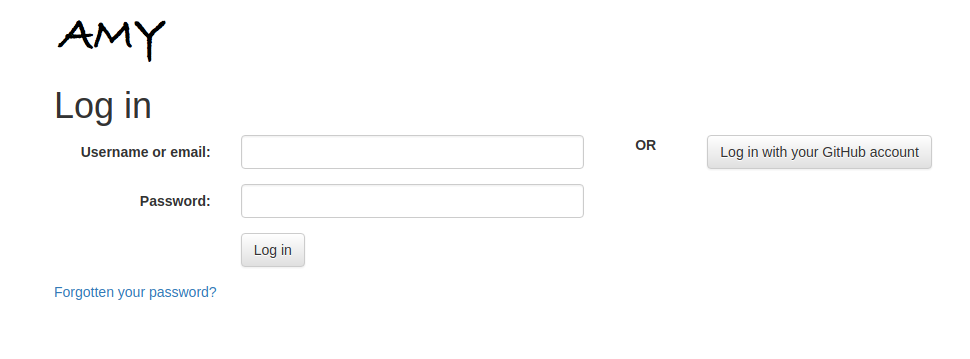
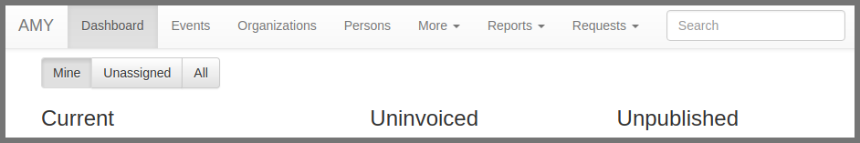
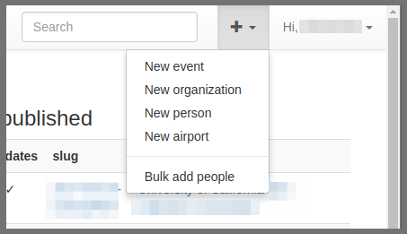
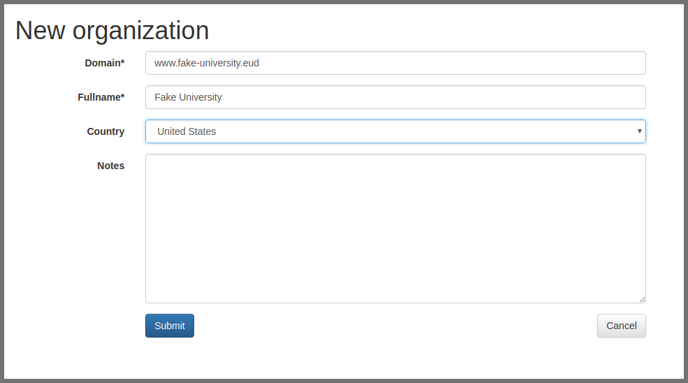

### How to use AMY, the Carpentries' internal database

* Log in to AMY [here](https://amy.software-carpentry.org/workshops/admin-dashboard/).  Contact Carpentries staff if you need login credentials.

All the menus and a search bar are displayed across the top. The main page has three column view showing published workshops, uninvoiced workshops, and unpublished workshops.

This view can be filtered to show workshops assigned to the logged in administrator, unassigned workshops, or all workshops.

* *Published workshops* have a complete start and end date, a valid url, and a complete location
* *Uninvoiced workshops* are those the invoice status is marked "Invoice not requested"
* *Unpublished workshops* are all workshops that do not meet the criteria to be published

From here you can also add new persons, events, organizations, or airports to the database.

Adding a new organization

If the site name is not already in AMY, add a new one by selecting "New Organization." Do not enter `http://` or any slashes in the domain name.

* View existing events

* Enter in a completely new event
Workshop request comes to us via email
* go to AMY, click on "new event" and enter in all info on event page
* can use "import from url" if you already have the github page
* Add new organization if needed

Workshop request comes to us via AMY form
* Accept all requests, even if you're not sure the workshop will happen. We want a record of all requests.
* go to form, click accept, enter in all info needed on event page
* can use "import from url" if you already have the github page
* Add new organization if needed

* Create event based on workshop request
* Merge a new event record into an existing record

* Create a new person

* Create a new organization

* Update event, person, or organization

(Include screenshots)

===========
Workflow reference - to be incorporated above

### Skeleton of AMY workflow

Workshop request comes to us via email
* go to AMY, click on "new event" and enter in all info on event page
* can use "import from url" if you already have the github page
* Add new organization if needed

Workshop request comes to us via AMY form
* Accept all requests, even if you're not sure the workshop will happen. We want a record of all requests.
* go to form, click accept, enter in all info needed on event page
* can use "import from url" if you already have the github page
* Add new organization if needed

Be sure we are slugs (ids) are formatted consistently
* YYYY-MM-DD-site_name
* Be sure our id matches id used in github page and ids used anywhere else *exactly*
* Fill in XX if dates are not known; change this once dates are confirmed

Host name
* Select host site from drop down menu
* Create new [host entry]() if not in the database

Once instructors are confirmed
* Go to "Tasks" tab and enter in instructors, helpers, hosts, and organizers
* Create person profiles for any names not in the database
* Use the [bulk add persons](#) feature if necessary.

