## AMY: the Carpentries' internal database

### Logging in

* Log in to AMY [here](https://amy.software-carpentry.org/workshops/admin-dashboard/).  Contact Carpentries staff if you need login credentials.

### AMY dashboard

All the menus and a search bar are displayed across the top. The main page has three column view showing published workshops, uninvoiced workshops, and unpublished workshops.

This view can be filtered to show workshops assigned to the logged in administrator, unassigned workshops, or all workshops.

* *Published workshops* have a complete start and end date, a valid url, and a complete location
* *Uninvoiced workshops* are those the invoice status is marked "Invoice not requested"
* *Unpublished workshops* are all workshops that do not meet the criteria to be published

From here you can also add new persons, events, organizations, or airports to the database.

### Adding a new organization

If the site name is not already in AMY, add a new one by selecting "New Organization." Do not enter `http://` or any slashes in the domain name.

### Adding a new person

If a person's record does not exist in the database, it can be added individually or as part of a bulk upload.

#### Adding an individual record

Select "New person" and enter in as much information as possible.  At minimum a personal name is required.  If the airport is not listed, it will need to be [added in](#adding-a-new-airport).

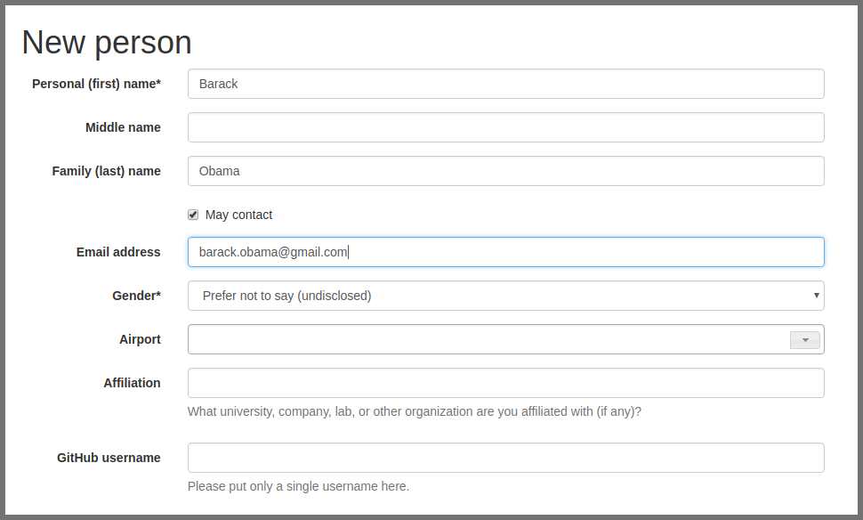

#### Adding bulk records

If the person has a role associated with a specific event, `Person` records can also be added in bulk using the `Bulk add persons` menu option in the regular `+` menu or the `More` menu.

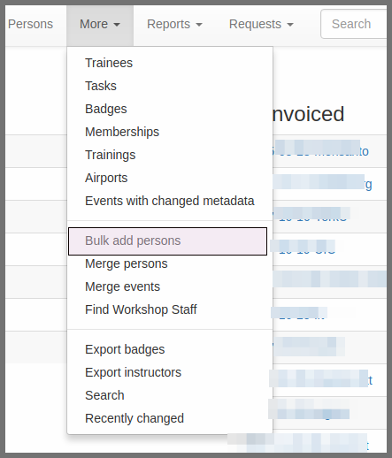

Use the blank template to generate a well formed csv noting each person's personal name, family name, email address, role, and associated event.

The role must exactly match the instructions. The event slug must exactly match the slug for the event recorded in AMY.

This will take you to a screen where you can verify each record, correct any errors, and submit them for bulk upload.

### Adding a new airport

Airports are used as approximate geographic identifiers for our instructors.  Each airport is identified by its three digit IATA code which can be looked up using the link in AMY.

Enter in the airport's IATA code, full name, country, and latitude and longitude.

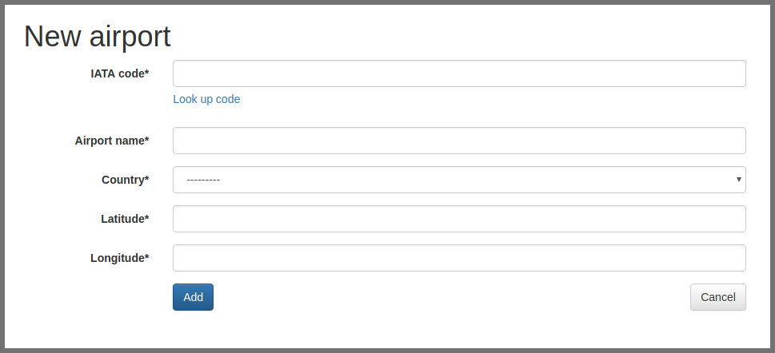

### Adding a new event

New events can be created one of several ways:
* By manually entering all information on the [new event page](#)
* By importing from URL on the [new event page](#)
* By accepting a [workshop request](#)

#### Creating a new event manually

* Create the workshop slug.  This must be in the form `YYYY-MM-DD-sitename` (for example, `2018-01-01-hawkins`.  The same slug should be used for the workshop's github page and any other place the workshop is identified.  If the exact date is not known, `XX` can replace the month and/or day (for example, `2018-01-xx-starfleet`).  

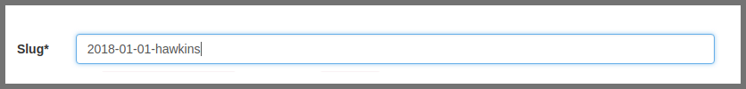

* If known, enter in the workshop dates.  

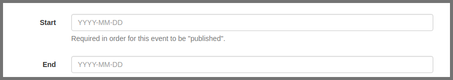

* Select the host site name from the drop down menu. If the host site does not appear on the list, [create a new organization](#).

* Select the administrator from the drop down menu.  This will almost always be `Software Carpentry`, `Data Carpentry`, or `self organized`.

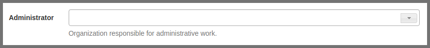

* Select the name of the Carpentries administrator responsible for managing this workshop.  

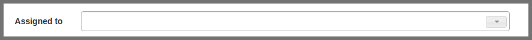

* Assign all appropriate tags to the event.

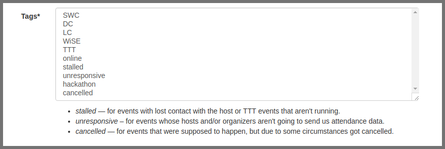

* Enter in the workshop's url (to the github page, not the repo). This is generally in the format `username.github.io/YYYY-MM-DD-sitename`.

* Enter in the human language the workshop is taught in. This is especially important for the Carpentries to track workshops in languages other than English.

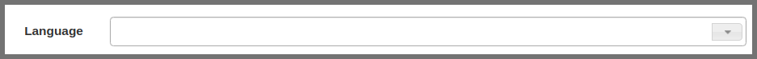

* If the workshop is using **Carpentries** Eventbrite for registration, enter the Eventbrite key.  This is not need if the host site is using their own Eventbrite account or any other internal system.

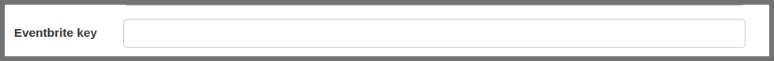

* If the event has a fee due to Carpentries, enter it in and note when the invoice has been requested to be sent to the host site.  If there is no fee due, note the reason why.

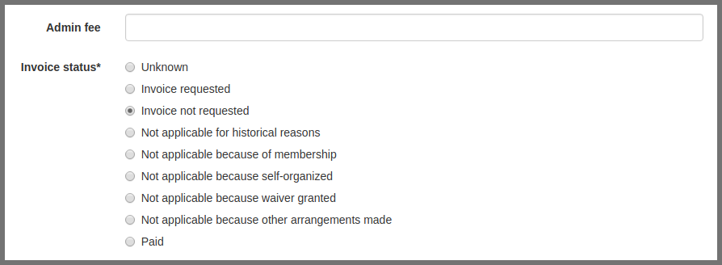

* After the event is over, record the total number of learners who attended the workshop.

* Enter the email address only of the main contact person for this event.

* Add in any othern notes that may not be covered in any fields above.
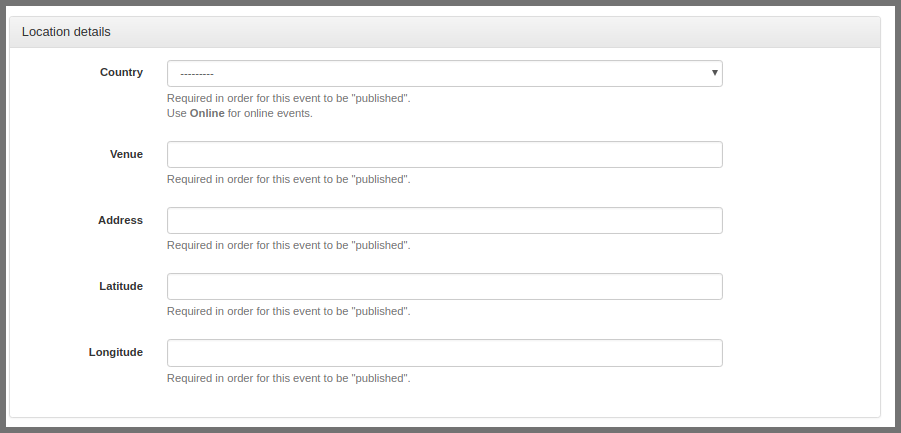

* Add in the location including the country, venue name, address, and latitude/longitude coordinates.

#### Creating a new event from URL

If you already have the event's URL with properly formatted metadata, the following information can automatically be imported in:

* Slug (created from github repo name)
* Start and end dates
* Location details

Instructor and helper names will be in the notes field but not assigned in the database.  All people will need to be [assigned to the event](#).

All other information will need to be entered in as above.

#### Creating a new event from a workshop request

Instructions go here

### Assigning people to events

Instructions go here

### Other tasks

#### Merging duplicate persons
#### Merging duplicate events
#### Searching

