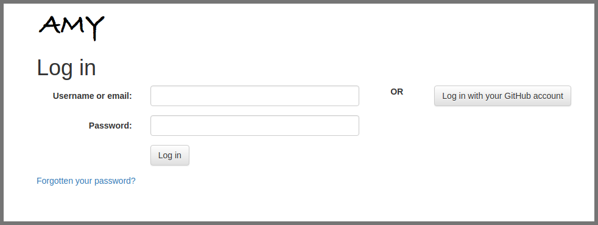

### How to use AMY, the Carpentries' internal database

* Log in to AMY [here](https://amy.software-carpentry.org/workshops/admin-dashboard/).  Contact Carpentries staff if you need login credentials.

* The dashboard view will show....

* View existing events

* Enter in a completely new event
Workshop request comes to us via email
* go to AMY, click on "new event" and enter in all info on event page
* can use "import from url" if you already have the github page
* Add new organization if needed

Workshop request comes to us via AMY form
* Accept all requests, even if you're not sure the workshop will happen. We want a record of all requests.
* go to form, click accept, enter in all info needed on event page
* can use "import from url" if you already have the github page
* Add new organization if needed

* Create event based on workshop request
* Merge a new event record into an existing record

* Create a new person

* Create a new organization

* Update event, person, or organization

(Include screenshots)
